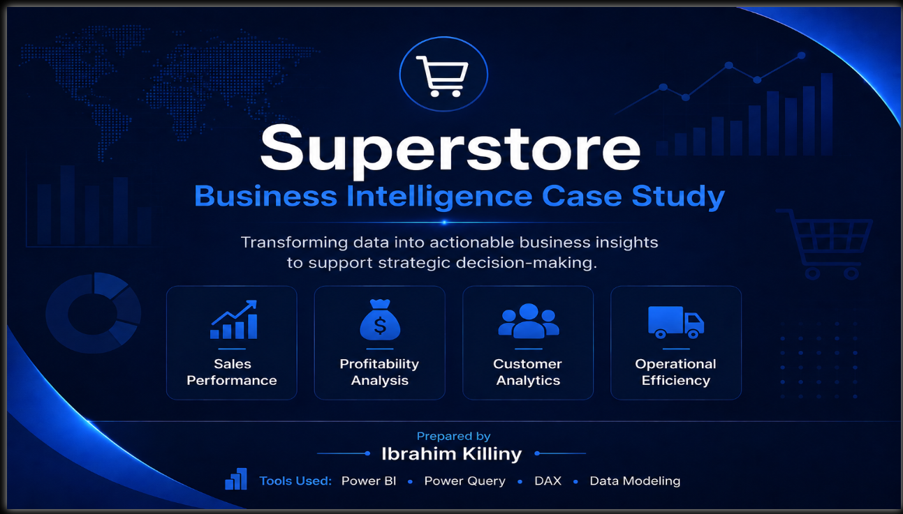
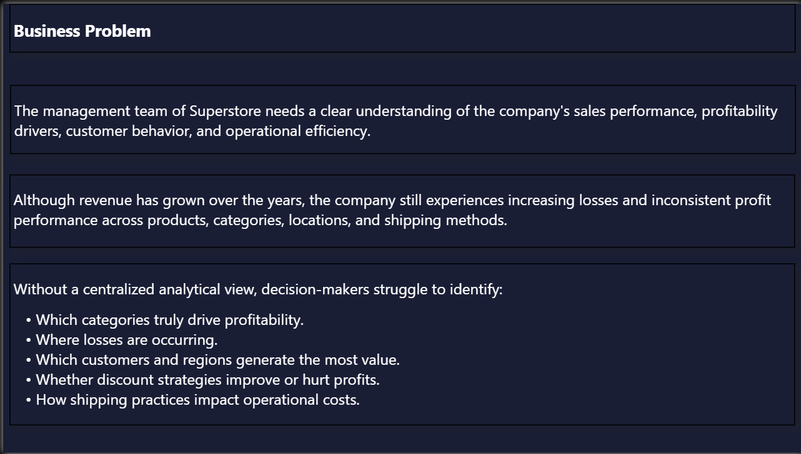
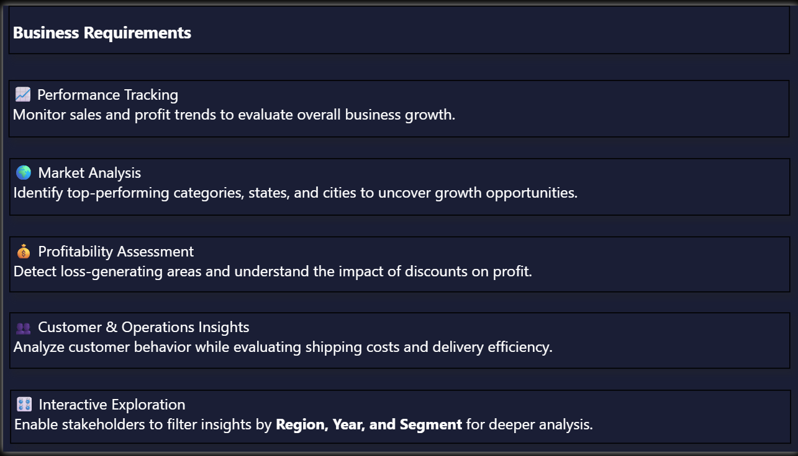
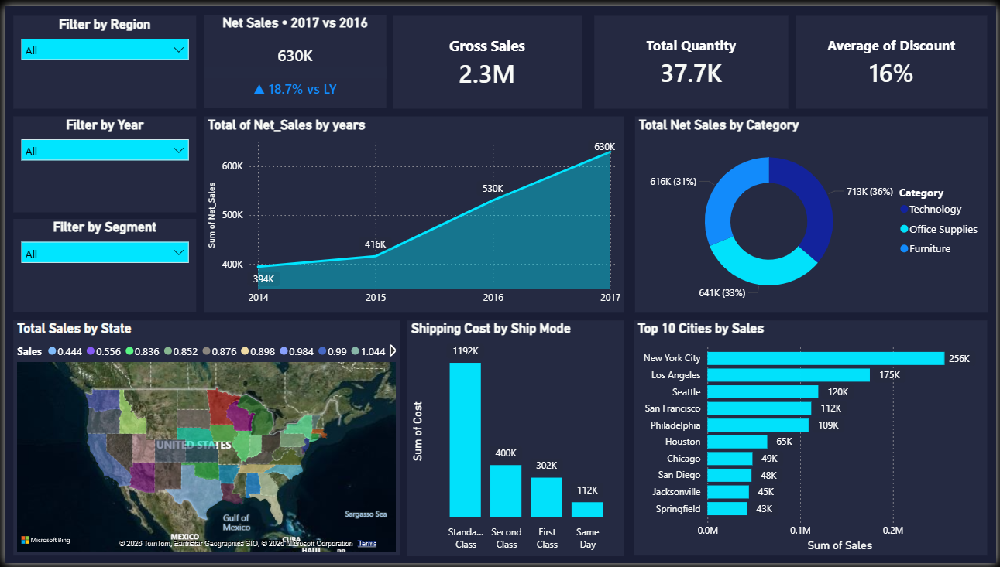
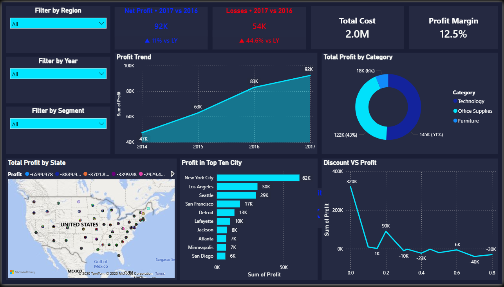
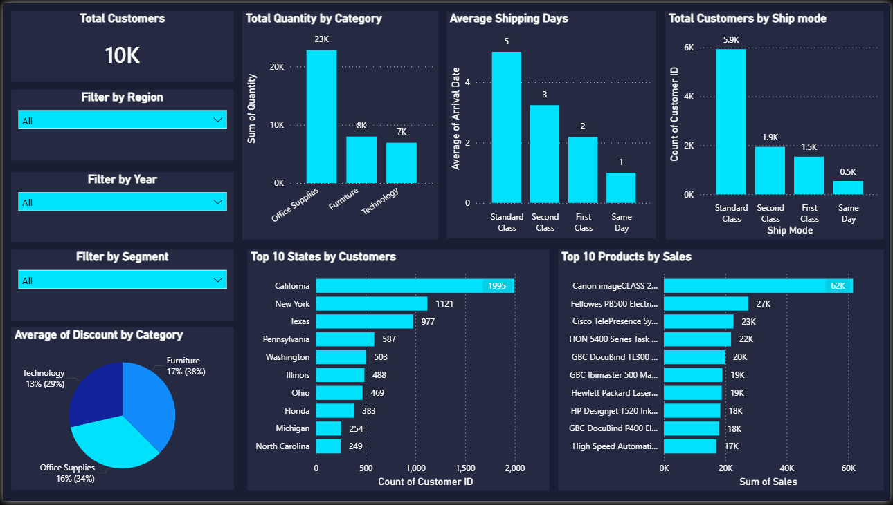
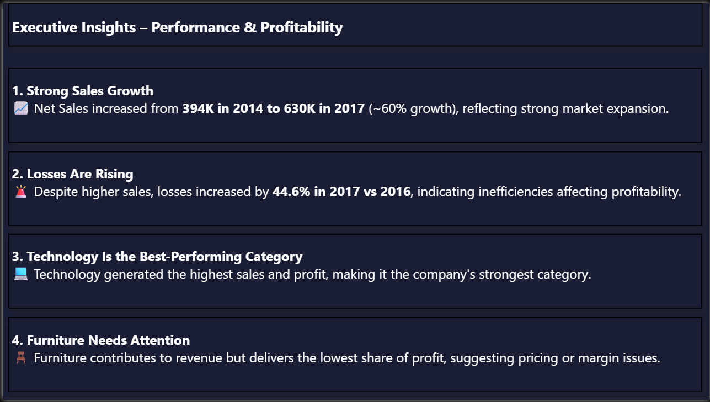
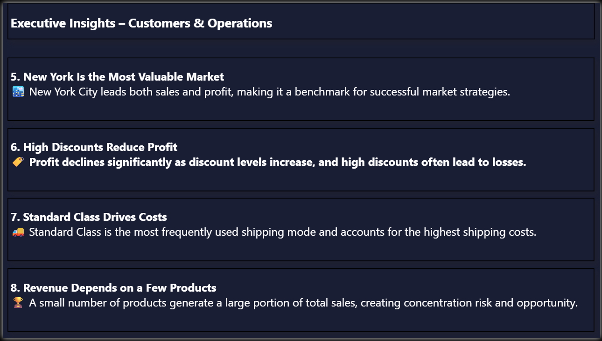
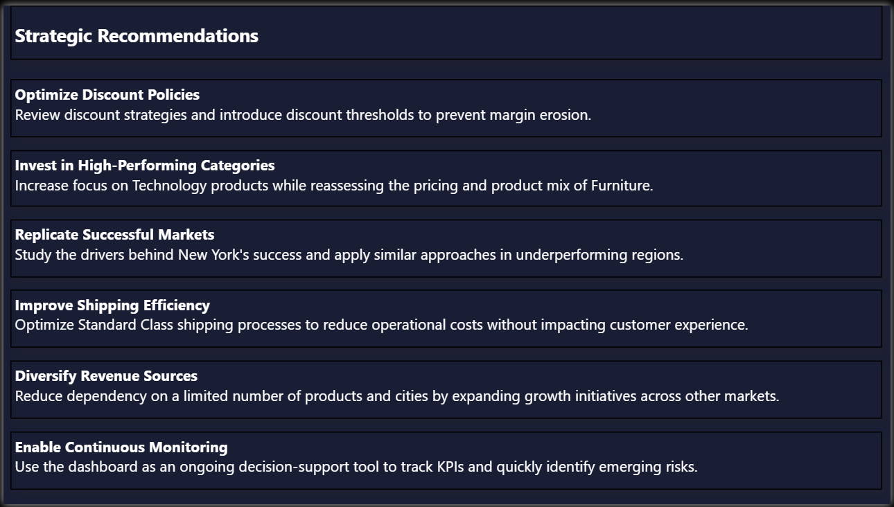

# Superstore-Business-Intelligence-Case-Study
A business intelligence case study built with Power BI, transforming Superstore transactional data into executive insights and strategic recommendations through interactive dashboards.

# 🛒 Superstore Sales & Profit Analysis Dashboard

## 📌 Project Overview

This project presents an end-to-end business intelligence solution built using **Power BI** to analyze the performance of a retail superstore business.

The dashboard transforms raw transactional data into meaningful business insights, enabling stakeholders to monitor performance, identify profitability drivers, understand customer behavior, and support data-driven decision-making.

The project goes beyond visualization by following a complete analytical approach:

**Business Problem → Requirements → Analysis → Insights → Recommendations**

---

## 📷 Dashboard Preview

### Cover Page



---

## 🎯 Business Problem

The management team of Superstore needs a clear understanding of the company's sales performance, profitability drivers, customer behavior, and operational efficiency.

Although revenue has grown over the years, the company still experiences increasing losses and inconsistent profit performance across products, categories, locations, and shipping methods.

Without a centralized analytical view, decision-makers struggle to identify:

* Which categories truly drive profitability?
* Where losses are occurring.
* Which customers and regions generate the most value?
* Whether discount strategies improve or hurt profits.
* How shipping practices impact operational costs.

### Business_Problem Page



---

## ✅ Business Requirements

The dashboard was designed to enable stakeholders to:

### 📈 Performance Tracking

Monitor sales and profit trends to evaluate overall business growth.

### 🌍 Market Analysis

Identify top-performing categories, states, and cities to uncover growth opportunities.

### 💰 Profitability Assessment

Detect loss-generating areas and understand the impact of discounts on profit.

### 👥 Customer & Operations Insights

Analyze customer behavior while evaluating shipping costs and delivery efficiency.

### 🎛️ Interactive Exploration

Enable stakeholders to filter insights by Region, Year, and Segment for deeper analysis.

### Business_Requirements Page



---

# 📊 Dashboard Pages

## 1. Sales Performance Dashboard

This page provides a comprehensive overview of revenue performance across different dimensions.

### Key Features:

* Net Sales trend analysis.
* Year-over-Year sales comparison.
* Top-performing categories.
* Top sales states and cities.
* Sales distribution analysis.

### Sales_Performance Dashboard



---

## 2. Profitability Analysis Dashboard

This page focuses on understanding profit performance and identifying areas that negatively impact profitability.

### Key Features:

* Net Profit trend analysis.
* Loss tracking.
* Profit margin monitoring.
* Category contribution to profit.
* Discount vs Profit analysis.

### Profitability_Analysis Dashboard



---

## 3. Customer & Operations Dashboard

This page analyzes customer distribution and operational efficiency.

### Key Features:

* Customer distribution by state.
* Top customer locations.
* Shipping mode analysis.
* Shipping cost monitoring.
* Delivery performance evaluation.

### Customer & Operations Dashboard



---

# 🛠️ Tools & Technologies

* Power BI
* Power Query
* DAX (Data Analysis Expressions)
* Data Modeling
* Data Visualization
* Business Intelligence
* Interactive Dashboard Design

---

# 📌 KPIs Used

The dashboard monitors several key performance indicators, including:

* Net Sales
* Net Profit
* Profit Margin
* Total Losses
* Customer Count
* Shipping Cost
* Quantity Sold
* Year-over-Year Growth
* Category Performance

---

# 💡 Executive Insights

After analyzing the data, several important business insights emerged:

### 📈 Strong Sales Growth

Net Sales increased from **394K in 2014 to 630K in 2017**, reflecting strong business expansion.

---

### 🚨 Rising Losses

Despite higher sales, losses increased by **44.6% year-over-year**, indicating operational inefficiencies affecting profitability.

---

### 💻 Technology Leads Performance

Technology generated the highest sales and profit, making it the strongest-performing category.

---

### 🪑 Furniture Requires Attention

Furniture contributes significantly to revenue but delivers relatively low profitability, suggesting margin pressure.

---

### 🏙️ New York Is the Most Valuable Market

New York City leads both sales and profit generation, representing a benchmark for successful market strategies.

---

### 🏷️ Discounts Reduce Profitability

Higher discount levels were associated with declining profits and, in some cases, negative returns.

---

### 🚚 Standard Class Drives Operational Costs

Standard Class shipping accounts for the highest usage and shipping costs, making it a priority for optimization efforts.

---

### 🏆 Revenue Concentration Risk

A limited number of products contribute disproportionately to overall sales, creating both opportunity and risk.

### Performance&Profitability_Insights Page




### Customers&Operations_Insights Page


---

# 🚀 Strategic Recommendations

Based on the analysis, the following actions are recommended:

### Optimize Discount Policies

Review discount strategies and establish thresholds to prevent margin erosion.

### Invest in High-Performing Categories

Increase focus on Technology products while reassessing Furniture pricing and product mix.

### Replicate Successful Markets

Study the drivers behind New York's success and apply similar approaches to underperforming regions.

### Improve Shipping Efficiency

Optimize Standard Class shipping operations to reduce operational costs.

### Diversify Revenue Sources

Reduce dependency on a limited number of products and markets.

### Enable Continuous Monitoring

Use the dashboard regularly to support strategic planning and monitor emerging risks.

### Strategic_Recommendations Page



---

# 📂 Repository Structure

```
├── Data/
├── Dashboard/
├── Images/
├── README.md
└── Superstore Dashboard.pbix
```

---

# 🎯 Project Outcomes

This project demonstrates the ability to:

* Transform raw data into actionable insights.
* Build interactive and user-friendly Power BI dashboards.
* Apply business thinking alongside technical skills.
* Translate analytical findings into strategic recommendations.
* Support executive decision-making through data storytelling.

---

# 👨‍💻 About This Project

This dashboard was developed as a portfolio project to showcase practical skills in:

* Data Analysis
* Business Intelligence
* Power BI Development
* Data Visualization
* DAX
* Business Storytelling

If you found this project interesting, feel free to explore the dashboard and connect with me for feedback or collaboration.
